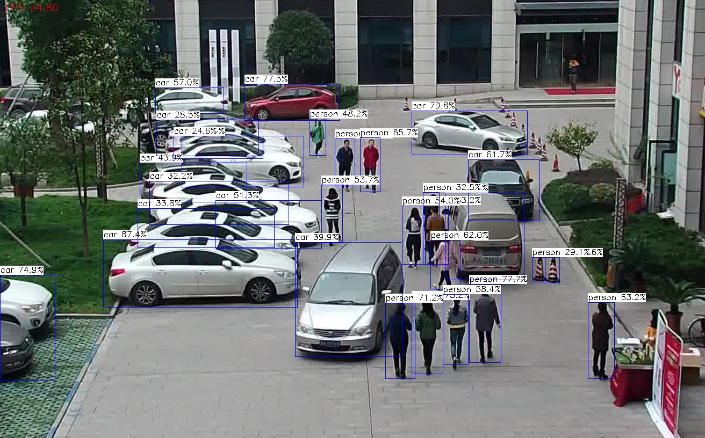

# YoloV5 NPU

## YoloV5 for RK3566/68/88 NPU (Rock 5, Orange Pi 5, Radxa Zero 3)

Special made for the NPU, see [Q-engineering deep learning examples](https://qengineering.eu/deep-learning-examples-on-raspberry-32-64-os.html)

------------

## Model performance benchmark (FPS)

All models, with C++ examples can be found on the SD images.<br><br>

All models are quantized to **int8**, unless otherwise noted.<br>

| demo             | model_name                   | RK3588  | RK3566/68  |
| ---------------- | ---------------------------- | :-----: | :--------: |
| yolov5           | yolov5s_relu                 | 50.0    | 14.8       |
|                  | yolov5n                      | 58.8    | 19.5       |
|                  | yolov5s                      | 37.7    | 11.7       |
|                  | yolov5m                      | 16.2    | 5.7        |
| yolov6           | yolov6n                      | 63.0    | 18.0       |
|                  | yolov6s                      | 29.5    | 8.1        |
|                  | yolov6m                      | 15.4    | 4.5        |
| yolov7           | yolov7-tiny                  | 53.4    | 16.1       |
|                  | yolov7                       | 9.4     | 3.4        |
| yolov8           | yolov8n                      | 53.1    | 18.2       |
|                  | yolov8s                      | 28.5    | 8.9        |
|                  | yolov8m                      | 12.1    | 4.4        |
| yolov10          | yolov10n                     | 35.1    | 12.5       |
|                  | yolov8s                      | 23.4    | 7.3        |
|                  | yolov8m                      |  9.7    | 3.4        |
|                  | yolov8x                      |  5.1    | 1.8        |
| yolox            | yolox_s                      | 30.0    | 10.0       |
|                  | yolox_m                      | 12.9    | 4.8        |
| ppyoloe          | ppyoloe_s                    | 28.8    | 9.2        |
|                  | ppyoloe_m                    | 13.1    | 5.04       |
| yolov5_seg       | yolov5n-seg                  | 9.4     | 1.04       |
|                  | yolov5s-seg                  | 7.8     | 0.87       |
|                  | yolov5m-seg                  | 6.1     | 0.71       |
| yolov8_seg       | yolov8n-seg                  | 8.9     | 0.91       |
|                  | yolov8s-seg                  | 7.3     | 0.87       |
|                  | yolov8m-seg                  | 4.5     | 0.7        |
| ppseg	           | ppseg_lite_1024x512          | 27.5    | 2.4        |
| RetinaFace       | RetinaFace_mobile320<sup>1</sup>    | 243.6   | 88.5       |
|                  | RetinaFace_resnet50_320<sup>1</sup> | 43.4    | 11.8       |
| PPOCR-Det        | ppocrv4_det<sup>2</sup>             | 31.5    | 15.1       |
| PPOCR-Rec        | ppocrv4_rec<sup>3</sup>             | 35.7    | 17.3       |

<sup>1</sup> Input size 320x320<br>
<sup>2</sup> Input size 480x480<br>
<sup>3</sup> Input size 48x320, FP16<br>
* Due to the pixel-wise filling and drawing, segmentation models are relatively slow

------------

## Dependencies.
To run the application, you have to:
- OpenCV 64-bit installed.
- Optional: Code::Blocks. (```$ sudo apt-get install codeblocks```)

### Installing the dependencies.
Start with the usual 
```
$ sudo apt-get update 
$ sudo apt-get upgrade
$ sudo apt-get install cmake wget curl
```
#### OpenCV
Follow the Raspberry Pi 4 [guide](https://qengineering.eu/install-opencv-on-raspberry-64-os.html).<br>

#### RKNPU2
```
$ git clone https://github.com/airockchip/rknn-toolkit2.git
```
We only use a few files.
```
rknn-toolkit2-master
│      
└── rknpu2
    │      
    └── runtime
        │       
        └── Linux
            │      
            └── librknn_api
                ├── aarch64
                │   └── librknnrt.so
                └── include
                    ├── rknn_api.h
                    ├── rknn_custom_op.h
                    └── rknn_matmul_api.h

$ cd ~/rknn-toolkit2-master/rknpu2/runtime/Linux/librknn_api/aarch64
$ sudo cp ./librknnrt.so /usr/local/lib
$ cd ~/rknn-toolkit2-master/rknpu2/runtime/Linux/librknn_api/include
$ sudo cp ./rknn_* /usr/local/include
```
Save 2 GB of disk space by removing the toolkit. We do not need it anymore.
```
$ cd ~
$ sudo rm -rf ./rknn-toolkit2-master
```

------------

## Installing the app.
To extract and run the network in Code::Blocks <br/>
```
$ mkdir *MyDir* <br/>
$ cd *MyDir* <br/>
$ git clone https://github.com/Qengineering/YoloV5-NPU.git <br/>
```

------------

## Running the app.
You can use **Code::Blocks**.
- Load the project file *.cbp in Code::Blocks.
- Select _Release_, not Debug.
- Compile and run with F9.
- You can alter command line arguments with _Project -> Set programs arguments..._ 

Or use **Cmake**.
```
$ cd *MyDir*
$ mkdir build
$ cd build
$ cmake ..
$ make -j4
```
Make sure you use the model fitting your system.<br><br>

More info or if you want to connect a camera to the app, follow the instructions at [Hands-On](https://qengineering.eu/deep-learning-examples-on-raspberry-32-64-os.html#HandsOn).<br/><br/>

------------
## yolov5-npu
### Setup

- Check libraries
```
$ tree /opt/runtime/
/opt/runtime/
├── include
│   ├── rkllm.h
│   ├── rknn_api.h
│   ├── rknn_custom_op.h
│   └── rknn_matmul_api.h
├── librkllmrt.so
└── librknnrt.so
```

- Set `RUNTIME_LIB_PATH` environment variable
```
$ export RUNTIME_LIB_PATH=/opt/runtime  # for example only
$ export RUNTIME_LIB_PATH=/mnt/datadrive/storage/data/runtime
$ echo $RUNTIME_LIB_PATH       # check
```
- Clone
```
$ cdp
$ git clone https://github.com/akhud78/yolov5-npu
$ cd yolov5-npu
```

- Build and test
```
$ mkdir build
$ cd build
$ cmake ../src
$ make
$ ./yolov5_npu
Usage: ./yolov5_npu imagepath [model] [output]
```

### Run
```
$ ./yolov5_npu ../parking.jpg ../rk3588/yolov5n.rknn

model: ../rk3588/yolov5n.rknn
post process config: box_conf_threshold = 0.25, nms_threshold = 0.45
Loading model ...
sdk version: 2.3.2 (429f97ae6b@2025-04-09T09:09:27) driver version: 0.9.8

model input num: 1
	index=0, name=images, 
		n_dims=4, dims=[1, 640, 640, 3], 
		n_elems=1228800, size=1228800, fmt=NHWC, 
		type=INT8, qnt_type=AFFINE, zp=-128, scale=0.003922

model output num: 3
	index=0, name=output0, 
		n_dims=4, dims=[1, 255, 80, 80], 
		n_elems=1632000, size=1632000, fmt=NCHW, 
		type=INT8, qnt_type=AFFINE, zp=-128, scale=0.003917
	index=1, name=343, 
		n_dims=4, dims=[1, 255, 40, 40], 
		n_elems=408000, size=408000, fmt=NCHW, 
		type=INT8, qnt_type=AFFINE, zp=-128, scale=0.003922
	index=2, name=345, 
		n_dims=4, dims=[1, 255, 20, 20], 
		n_elems=102000, size=102000, fmt=NCHW, 
		type=INT8, qnt_type=AFFINE, zp=-128, scale=0.003922

model input is NHWC
model input height=640, width=640, channel=3

Start grabbing ...
FPS2.40385
FPS5.12124
FPS7.7254
FPS10.7016
FPS14.1738
FPS17.0147
FPS19.9909
FPS22.5951
FPS25.3125
FPS28.1534
FPS30.6534
FPS33.9429
FPS36.9191
FPS39.1512
FPS41.555
FPS44.396
FPS44.9683
FPS45.0918
FPS44.8025
FPS44.8025
Check output: '/tmp/yolov5_out.jpg'
```



- [run.sh](run.sh) - batch processing of input images

